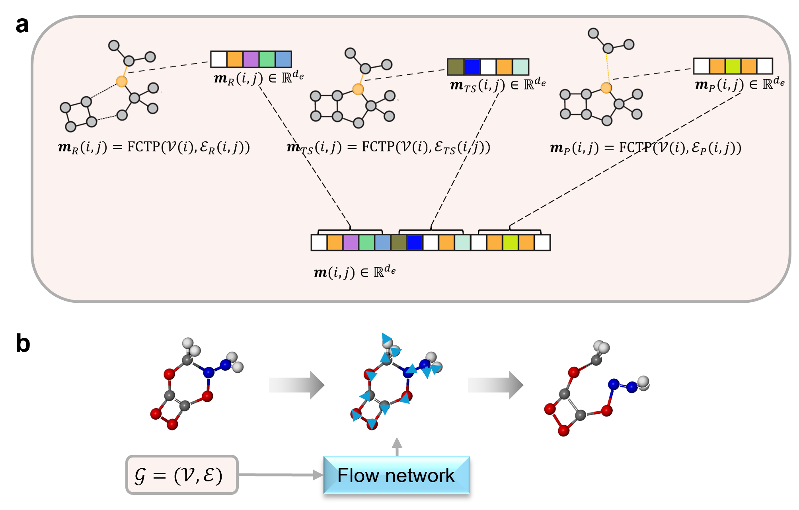

# TS-GEN

Implementation of [Flow matching for reaction pathway generation](https://arxiv.org/abs/2507.10530) by Ping Tuo*, Jiale Chen, Ju Li*.

A flow matching model learns a transformation from an initial distribution, typically a standard Gaussian, to a target distribution. This transformation is defined by an optimal transport path connecting the source and target distributions. A neural network is trained to approximate the corresponding velocity field that governs the evolution of the interpolant along this path.

MolGEN extends this framework by introducing a conditioning mechanism that steers the generation process toward specific target distributions. MolGEN employs a message passing neural network (MPNN) architecture. For the task of TS generation, we modify the MPNN by concatenating the messages of the transition state (TS) interpolant and the reaction-product pair (RP) to form a reaction message, as illustrated in the Figure bellow. This process integrates the bond information of all three states into the reaction messages. Analogously, for the task of reaction product generation, we concatenate the messages of the reactant and the product interpolant to form the reaction message.
Subsequently, the model passes these reaction messages through message passing layers to predict the velocity field that evolves the distribution. 

MolGEN initiates with a standard Gaussian distribution. Therefore, it also incorporates stochasticity while performing a deterministic forward pass. The probability path simulated by MolGEN resembles that of a diffusion model, in the sense that both follow a transformation from a standard Gaussian distribution to a jagged target distribution. Consequently, MolGEN is capable of exploring the free energy surface as effectively as diffusion-based models, while using 100 times less inference time.

Please feel free to reach out to us at tuoping@berkeley.edu, liju@mit.edu with any questions.




## Installation

```
pip install numpy==1.26.0 pandas==1.5.3 scikit-learn==1.6.1
pip install torch==2.6.0 -f https://download.pytorch.org/whl/torch_stable.html
pip install pytorch_lightning==2.0.4 mdtraj==1.9.9 biopython==1.79
pip install wandb dm-tree einops torchdiffeq fair-esm pyEMMA
pip install matplotlib==3.7.2
pip install omegaconf==2.3.0
pip install ase==3.22 pymatgen
# before installing torch_scatter, make sure the libstdc++.so.6 include GLIBCXX_3.4.32 by `strings .../libstdc++.so.6.0.33 | grep GLIB`
TORCH=2.6.0 
CUDA=cu124
pip install pyg_lib torch_scatter torch_sparse torch_cluster torch_spline_conv torch_geometric  -f https://data.pyg.org/whl/torch-${TORCH}+${CUDA}.html
```

## Datasets
- We encourage interested users to download our preprocessed data here: https://drive.google.com/file/d/1k5Nb1j7BCzUspRtXnbVR8tyhNhrv1YDy/view?usp=drive_link

  Steps to download and preprocess the original data:

  1. Download the Transition1x datasets:
  ```
  git clone https://gitlab.com/matschreiner/Transition1x
  cd Transition1x
  pip install .
  ```
  2. Preprocess the Transition1x datasets by `./scripts/Transition1x/prep_data.ipynb`
  3. Download the [RGD1](https://github.com/zhaoqy1996/RGD1) database here: https://figshare.com/articles/dataset/model_reaction_database/21066901
  4. Preprocess the RGD1 datasets by `./scripts/RGD1/prep_data.ipynb`

- All the configurations generated for the KHP decomposition network is in `results-KHP`.

## Training

Commands similar to these were used to train the models presented in the paper.
```

python train-Transition1x-equivariant.py --tps_condition  --data_dir data/Transition1x/  --ckpt_freq 1  --epochs 2000 --run_name $workdir_name --cutoff 12 --val_epoch_freq 5 --x0std 1.0  --batch_size 64 --ratio_conditonal 1.0 --weight_loss_var_x0 0.0 --pbc --object_aware --path-type Linear  --KL symm --lr_decay 

```

## Model weights

The model weights used in the paper may be downloaded here:
https://drive.google.com/drive/folders/1RdJShzr2hjqJpU4ZsnNRBSiJ84Wk3ASC?usp=drive_link


## Inference

Inference by 
```
python Transition1x-inference.py $ckpt_path $output_dir
```

## Analysis
- For static energy evaluation using pySCF, use `scripts/pydft-scripts/calculate_err_pyscf.py` (For the installation of PySCF, refer to: https://pyscf.org/user/install.html)
- For error evaluation of test set, use `scripts/calculate_err_pyscf_alltrials.ipynb`. 
- For transition state optimization using Psi4, use `scripts/pydft-scripts/ts_opt_psi4.py` (For the installation of Psi4, refer to: https://psicode.org/psi4manual/master/build_obtaining.html#faq-binarypackage. Tip: To use "wb97x-d3", one need to install an additional DFTD3 package by: `conda install dftd3 -c psi4  
`)
- For IRC calculations using Psi4, use `scripts/pydft-scripts/irc_*` 
- `scripts/calculate_err_pyscf_alltrials.py` is the script for full postprocessing including the IRC calculations.


## License

MIT. Additional licenses may apply for third-party source code noted in file headers.

## Citation
```
@misc{tuo2025accurate,
  title        = {Flow matching for reaction pathway generation},
  author       = {Tuo, Ping and Che n, Jiale and Li, Ju},
  year         = {2025},
  eprint       = {2507.10530},
  archivePrefix= {arXiv},
  primaryClass = {physics.chem-ph},
  doi          = {10.48550/arXiv.2507.10530},
  url          = {https://arxiv.org/abs/2507.10530}
}
```

## Acknowledgements

Code developed based on

[Generative Modeling of Molecular Dynamics Trajectories](https://github.com/bjing2016/mdgen)
